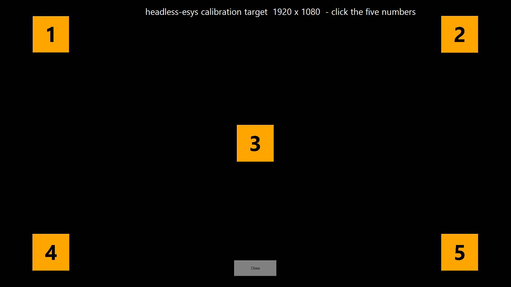

# headless-ista

**Let an AI agent run BMW ISTA+ diagnostics for you, headlessly.** An MCP server that
connects Claude (or any MCP client) to the Windows laptop at your car, so the agent
can read ISTA's fault memory and test plans as text, look the problem up on the web,
explain it, and click through ISTA's screens for you. You stay in charge of anything
that writes to the car.

Built and proven by a hobbyist on a 2018 G20 320d: the agent read a 244C00 turbo
pressure-converter fault, pulled BMW's own test plan and the vacuum diagram, and
pointed at a kinked hose by the dipstick. Fixed, and the next read showed the code gone.

> **Nothing is given away here.** This repo contains no BMW software or data. It is an
> MCP server plus documentation for people who **already run ISTA+** on a laptop and
> want an AI agent to drive it. You bring your own ISTA install, laptop and car.

## What it is, in plain words

You have a laptop in the garage with ISTA on it, plugged into the car. Normally you sit
there clicking through screens and reading German. With this, the laptop can sit with
nobody at it (headless) and an agent on your phone or computer does the reading and
clicking, talking to you in chat:

- It **reads** what ISTA is showing as text, not pixels: fault descriptions, test
  plans, procedures, wiring notes. No OCR, no squinting at screenshots. It translates
  the German as it goes.
- It **looks things up**: the fault code on Bimmerpost, known failure patterns for your
  model, part numbers. ISTA plus the web in one conversation.
- It **navigates**: opens the fault, starts the test plan, reads the next step, reports
  the measurement, asks what you found.
- It **asks before anything that writes**: clearing faults, service functions, actuator
  tests on safety systems, coding or programming. Those need you to type a go.
- It **keeps notes**: a timestamped log of what was read and decided, so you can pick
  up next weekend where you left off.

## Why ISTA and not E-Sys

ISTA is BMW's dealer diagnostic system. It has guardrails: it checks compatibility,
refuses nonsense, and guides you step by step. E-Sys coding has none of that; it will
execute whatever you tell it, and an agent on top inherits that. This project started
with both and deliberately dropped the coding side from the public tool after an honest
conversation with people who know E-Sys better than we do. The coding work is kept on
the [`esys` branch](https://github.com/chrisbray85/headless-ista/tree/esys) for
reference and is unsupported.

## Credits

- **ISTA+** is BMW AG's diagnostic system; this project only drives it through its
  normal window and reads the documents it renders.
- The community on Bimmerpost and Bimmerfest, whose threads are what the agent's web
  lookups find.
- **EsysUltra** (<https://esysultra.com>), whose developer's candid advice shaped the
  decision above.

## How it works

```
MCP client (Claude Code)  ─stdio─▶  ista_mcp/server.py  ─ssh/scp over Tailscale─▶  Laptop at the car (Windows + ISTA+)
                                                                                    ├─ state.ps1     ISTA's displayed document as text + a frame + status, one call
                                                                                    ├─ grab.ps1      screen capture (DPI-aware, JPEG)
                                                                                    ├─ input.ps1     UIA click-by-name / coordinate click / keys / scroll
                                                                                    ├─ diagnose.ps1  why capture or input is not working
                                                                                    ├─ caltarget.ps1 calibration target window
                                                                                    └─ run-hidden.vbs launches the above with no console window
```

The two ideas that make it work:

1. **Read text as text.** ISTA renders whatever it is displaying to
   `%LOCALAPPDATA%\Temp\tempWebView.html`. `read_state()` and `read_doc()` parse that
   file: the full text in one round-trip. Screenshots are only for graphs and dialogs.
2. **Drive controls by name.** ISTA is a WPF app, so `list_controls()` returns real
   control names and `click_control("Start test plan")` acts on them through UI
   Automation, robust against layout changes. Coordinate clicks are the fallback.

SSH lands in Windows "Session 0", which cannot see the desktop; capture and input run
as scheduled tasks with the interactive token, launched with no console window.
Everything comes back as text or a small JPEG, so it works over a phone hotspot.

## Quick start

**Laptop (Windows 10/11):** OpenSSH server enabled, your SSH user is a local admin, a
desktop session logged in (auto-login recommended), Tailscale or another route in,
ISTA+ installed and working by hand.

**Your machine:**

```bash
git clone https://github.com/chrisbray85/headless-ista.git && cd headless-ista
python3 -m venv .venv && .venv/bin/pip install -r requirements.txt
claude mcp add-json ista-garage --scope user '{
  "command": "'$PWD'/.venv/bin/python",
  "args": ["'$PWD'/ista_mcp/server.py"],
  "env": { "ISTA_MCP_SSH": "user@100.x.y.z" }
}'
```

Add `"ISTA_MCP_ALLOW_INPUT": "1"` to the env only when you want the agent to click.
Without it the agent can read everything and click nothing.

**First session, in this order:** `diagnose()` → `setup()` → `calibrate()` →
`read_state()`. Then hand the agent [AGENTS.md](AGENTS.md); it is written for the agent
to read. From a terminal, `scripts/smoke.py --deploy` runs setup plus a check of every
tool.

## Calibration self-test

`calibrate()` opens a full-screen target with five numbered markers, reads the physical
screen size, clicks each marker through the normal input path, and reports:

```
screen 1920x1080 · capture 1920x1080 (match) · hits 5/5 · max error 0 px
```



Anything less means clicks would land in the wrong place. The usual causes, all handled
by `setup()`: display scaling (helpers are DPI-aware), laptop on battery (tasks default
to "don't start on batteries"), Defender quarantining the scripts, no desktop logged in.

## Tools

| Tool | Kind | What |
|---|---|---|
| `read_state()` / `read_doc()` | read | **The primary read.** ISTA's displayed document as text, plus a frame and ISTA's status, in one call. |
| `list_sessions()` / `read_log()` | read | ISTA's session folders and any file on the laptop. |
| `list_controls(name_filter)` | read | ISTA's buttons, tabs and items by real name. |
| `diagnose()` / `setup()` / `calibrate()` | check | Why capture or input isn't working; install; click-accuracy self-test. |
| `screenshot()` / `start_stream()` / `latest_frame()` | read | Frames for graphs and dialogs; near-live over a hotspot. |
| `run(command)` | read | Read-only shell on the laptop. |
| `click_control(name)` | input | Act on an ISTA control by name. Preferred. |
| `click` / `right_click` / `double_click` / `input_sequence` / `type_text` / `press_key` / `scroll` | input | Coordinate and keyboard fallbacks. |
| `ista_elevation(mode)` | admin | Read or change ISTA's run-as-admin layer (why clicks do or don't land). |

Input tools exist only with `ISTA_MCP_ALLOW_INPUT=1`. Every input tool's help text
carries the rule: read and navigate freely; anything that writes to the car waits for a
typed go.

## Disclaimer, read it

- **Hobby software; it can be wrong.** The agent reads a screen and decides what to
  click. It asks before anything that writes, but what you approve is on you.
- **You are responsible for your car.** Service functions and fault clearing have
  consequences; understand each step before you say go.
- **No affiliation** with BMW AG or any tool vendor. Nothing from BMW is included.
- **No warranty.** MIT licence.

## Documentation

- [docs/GUIDE.md](docs/GUIDE.md): a diagnostic session with the agent, start to finish,
  from the real 244C00 case, with the gotchas.
- [docs/GLOSSARY.md](docs/GLOSSARY.md): the German and BMW terms ISTA uses, explained.
- [AGENTS.md](AGENTS.md): the operating brief an agent reads before its first tool call.
- [CONTRIBUTING.md](CONTRIBUTING.md).

## Support the project

Evenings and weekends. If it saved you a trip to a garage:

[](https://buymeacoffee.com/chrisbray85)

Next up: fault memory as structured data, a "plug-in check" that messages you when a
new fault appears, and guided test plans with the agent narrating each step.

## License

MIT. See [LICENSE](LICENSE).
